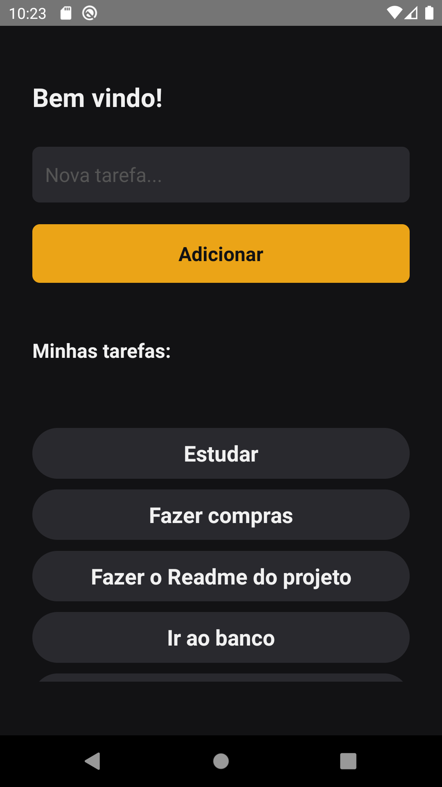
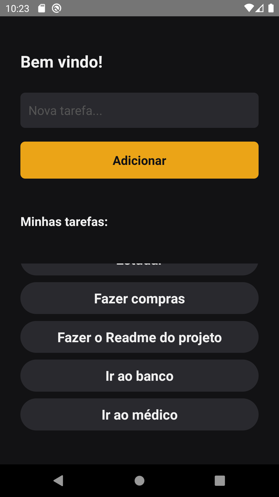
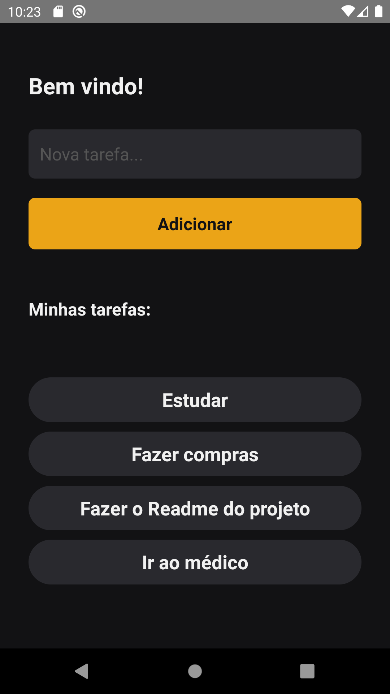

# DevPost


Uma simples lista de tarefas desenvolvida para fins de prática e estudo da linguagem TypeScript. 
<br/>
<br/>
<p align="center">

</p>

## Screenshots

<p align="center">
    
    
</p>

<p align="center">
    
    
</p>

## Tecnologias:
- React Native (v0.68.2)
- TypeScript
- Async-storage
- Context

___

## Instalação:

Clone o projeto e acesse a sua pasta: 

```sh
$ git clone https://github.com/thiagoemanoel98/myTasks.git
$ cd myTasks
```

Instale as dependências do projeto e inicie:

```sh
# Dependências
$ npm install

# Start Android
$ npx react-native run-android

# Start IOS
npx react-native run-ios
```

___

Made with :coffee: by Thiago Emanoel :v:
